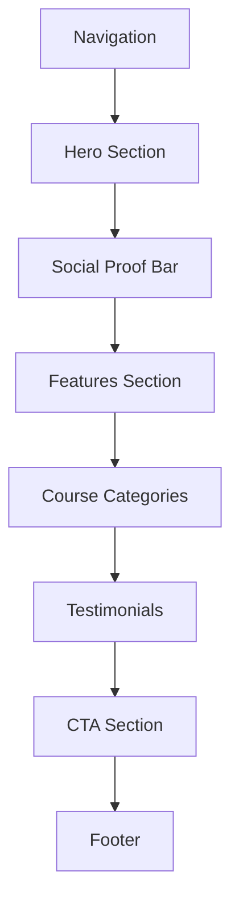
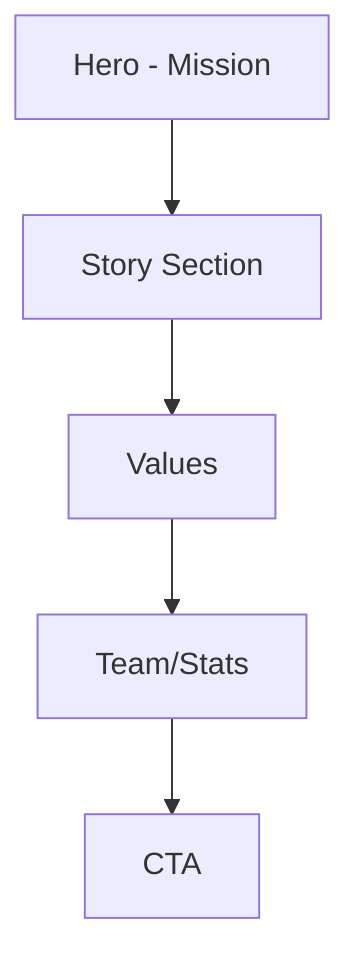

# UpSkill Frontend Redesign Specification

## Executive Summary

This document outlines a comprehensive redesign of the UpSkill learning platform frontend. The current design suffers from "AI slop" aesthetics - generic, uninspired layouts that lack visual identity and professional polish. This redesign addresses broken links, removes misleading "Free" CTAs, and implements a cohesive design system with proper visual hierarchy.

---

## 1. Current Issues Analysis

### 1.1 Broken Links
| Location | Issue | Fix |
|----------|-------|-----|
| `/about` link in nav | 404 - page doesn't exist | Create `/app/about/page.tsx` |
| `/about` link in hero CTA | 404 - page doesn't exist | Create `/app/about/page.tsx` |
| `/about` link in courses nav | 404 - page doesn't exist | Create `/app/about/page.tsx` |

### 1.2 Misleading CTAs
- **Homepage Hero**: "Start Learning Free" → Should link to courses or register
- **Courses Page**: "Create Free Account" → Remove "Free" - it's misleading
- **All CTAs**: "Free" creates false expectations

### 1.3 AI Design Hallmarks (Problems to Fix)
1. **Excessive whitespace** - Empty areas that add no value
2. **Generic gray backgrounds** - `bg-gray-50` everywhere
3. **Tiny, cramped cards** - No breathing room
4. **No visual hierarchy** - Everything same importance
5. **Ugly wrapper divs** - Nested containers with no purpose
6. **Inconsistent spacing** - Random padding/margins
7. **Missing visual polish** - No shadows, gradients, or depth
8. **Bland typography** - Only Inter, no personality
9. **No color system** - Just emerald as accent
10. **Flat, lifeless UI** - No depth or dimension

### 1.4 Navigation Inconsistency
- Homepage: Full nav with logo, courses, about, sign in, get started
- Courses page: Missing "Get Started" button in nav
- Dashboard: Different nav layout
- Course detail: Dark theme breaks consistency
- Login/Register: No nav at all (acceptable)

---

## 2. Design System Specification

### 2.1 Color Palette

```css
/* Primary - Emerald (keep but refine) */
--emerald-50: #ecfdf5;
--emerald-100: #d1fae5;
--emerald-500: #10b981;
--emerald-600: #059669;
--emerald-700: #047857;
--emerald-900: #064e3b;

/* Secondary - Slate (for dark elements) */
--slate-50: #f8fafc;
--slate-100: #f1f5f9;
--slate-200: #e2e8f0;
--slate-300: #cbd5e1;
--slate-400: #94a3b8;
--slate-500: #64748b;
--slate-600: #475569;
--slate-700: #334155;
--slate-800: #1e293b;
--slate-900: #0f172a;

/* Accent Colors */
--amber-500: #f59e0b;  /* Highlights, badges */
--blue-500: #3b82f6;   /* Links, info */
--rose-500: #f43f5e;   /* Errors, alerts */

/* Neutrals */
--white: #ffffff;
--black: #0a0a0a;
```

### 2.2 Typography

```css
/* Font Stack */
--font-display: 'Clash Display', 'Inter', sans-serif;  /* Headings */
--font-body: 'Inter', sans-serif;                       /* Body text */

/* Scale */
--text-xs: 0.75rem;    /* 12px - captions */
--text-sm: 0.875rem;   /* 14px - secondary */
--text-base: 1rem;     /* 16px - body */
--text-lg: 1.125rem;   /* 18px - lead */
--text-xl: 1.25rem;    /* 20px - h4 */
--text-2xl: 1.5rem;    /* 24px - h3 */
--text-3xl: 1.875rem;  /* 30px - h2 */
--text-4xl: 2.25rem;   /* 36px - h1 */
--text-5xl: 3rem;      /* 48px - hero */

/* Weights */
--font-normal: 400;
--font-medium: 500;
--font-semibold: 600;
--font-bold: 700;
```

### 2.3 Spacing System

```css
/* Base unit: 4px */
--space-1: 0.25rem;   /* 4px */
--space-2: 0.5rem;    /* 8px */
--space-3: 0.75rem;   /* 12px */
--space-4: 1rem;      /* 16px */
--space-5: 1.25rem;   /* 20px */
--space-6: 1.5rem;    /* 24px */
--space-8: 2rem;      /* 32px */
--space-10: 2.5rem;   /* 40px */
--space-12: 3rem;     /* 48px */
--space-16: 4rem;     /* 64px */
--space-20: 5rem;     /* 80px */
--space-24: 6rem;     /* 96px */
```

### 2.4 Component Specifications

#### Buttons
```css
/* Primary */
background: linear-gradient(135deg, #10b981 0%, #059669 100%);
padding: 12px 24px;
border-radius: 12px;
font-weight: 600;
box-shadow: 0 4px 14px rgba(16, 185, 129, 0.3);
transition: all 0.2s ease;

/* Hover */
transform: translateY(-2px);
box-shadow: 0 6px 20px rgba(16, 185, 129, 0.4);

/* Secondary */
background: #f1f5f9;
color: #1e293b;
border: 1px solid #e2e8f0;

/* Ghost */
background: transparent;
color: #475569;
```

#### Cards
```css
background: #ffffff;
border-radius: 16px;
border: 1px solid #e2e8f0;
box-shadow: 0 1px 3px rgba(0, 0, 0, 0.05);
transition: all 0.2s ease;

/* Hover state */
box-shadow: 0 10px 40px rgba(0, 0, 0, 0.1);
transform: translateY(-4px);
```

#### Input Fields
```css
background: #f8fafc;
border: 2px solid #e2e8f0;
border-radius: 12px;
padding: 14px 16px;
transition: all 0.2s ease;

/* Focus */
border-color: #10b981;
box-shadow: 0 0 0 4px rgba(16, 185, 129, 0.1);
```

---

## 3. Page-by-Page Redesign

### 3.1 Homepage (`/app/page.tsx`)

#### Current Problems:
- Generic hero with just text
- No visual interest
- "Learn More" goes to 404
- "Start Learning Free" is misleading

#### Redesign:



**Navigation:**
- Logo (left)
- Nav links: Courses, About (center)
- Auth buttons: Sign In, Get Started (right)
- Sticky with blur backdrop

**Hero Section:**
- Split layout: Text left, visual right
- Headline: Bold, 48-60px
- Subheadline: 18-20px, muted
- Two CTAs: "Start Learning" (primary), "Learn More" → /about (secondary)
- Visual: Abstract illustration or gradient blob

**Social Proof Bar:**
- "Trusted by 10,000+ learners"
- Company logos or stats

**Features Section:**
- 3-column grid
- Icon + title + description
- Subtle hover effects

**Course Categories:**
- Visual cards with icons
- Not just text links

**CTA Section:**
- Strong headline
- Single primary button
- Background gradient

### 3.2 About Page (NEW)

Create `/app/about/page.tsx`:



- Mission statement
- Story/background
- Core values (3-4 items)
- Stats (learners, courses, etc.)
- CTA to register

### 3.3 Courses Page (`/app/courses/page.tsx`)

#### Current Problems:
- List view is boring
- No visual hierarchy
- All cards look the same

#### Redesign:
- Grid layout (2-3 columns)
- Course cards with:
  - Category color coding
  - Icon
  - Title
  - Description (truncated)
  - Duration/lessons count
  - Progress indicator (if logged in)
- Search/filter bar at top

### 3.4 Course Detail Page (`/app/courses/[courseId]/page.tsx`)

#### Current Problems:
- Dark theme breaks consistency
- No navigation back to main site

#### Redesign:
- Match light theme of rest of site
- Add proper breadcrumb: Home > Courses > [Course Name]
- Course content with proper typography
- Sidebar with course navigation (if long)

### 3.5 Dashboard (`/app/dashboard/page.tsx`)

#### Current Problems:
- Basic stats cards
- No visual polish

#### Redesign:
- Welcome header with user name
- Progress overview (visual)
- Continue learning section
- Completed courses
- Quick stats with icons

### 3.6 Login/Register Pages

#### Current Problems:
- Basic centered card
- No visual interest

#### Redesign:
- Split layout: Form left, visual right
- Visual side with gradient/pattern
- Better form styling
- Social login options (future)

---

## 4. Implementation Tasks

### Phase 1: Foundation
1. [ ] Update `tailwind.config.ts` with design tokens
2. [ ] Update `globals.css` with CSS variables
3. [ ] Create shared Navigation component
4. [ ] Create shared Footer component

### Phase 2: Core Pages
5. [ ] Create `/app/about/page.tsx`
6. [ ] Fix navigation on all pages
7. [ ] Update homepage with new design
8. [ ] Update courses page

### Phase 3: Polish
9. [ ] Update course detail page
10. [ ] Update dashboard
11. [ ] Update auth pages
12. [ ] Add animations/transitions

### Phase 4: QA
13. [ ] Test all links
14. [ ] Test responsive design
15. [ ] Fix any issues

---

## 5. Design Principles

### 5.1 Visual Hierarchy
- Primary content: Largest, boldest, most contrast
- Secondary content: Medium size, muted
- Tertiary: Small, subtle

### 5.2 Spacing Rules
- Section padding: 80px vertical (desktop), 48px (mobile)
- Card padding: 24px
- Element gaps: 16px standard, 24px between sections

### 5.3 Depth & Dimension
- Use shadows for elevation
- Subtle gradients for interest
- Border radius for softness (12-16px)

### 5.4 Consistency
- Same components everywhere
- Same spacing system
- Same color usage
- Same typography scale

---

## 6. Acceptance Criteria

- [ ] All links work (no 404s)
- [ ] No "Free" in CTAs
- [ ] Consistent navigation on all pages
- [ ] Professional, polished appearance
- [ ] Responsive on mobile/tablet/desktop
- [ ] Fast loading (no heavy assets)
- [ ] Accessible (proper contrast, focus states)
- [ ] Consistent design language throughout